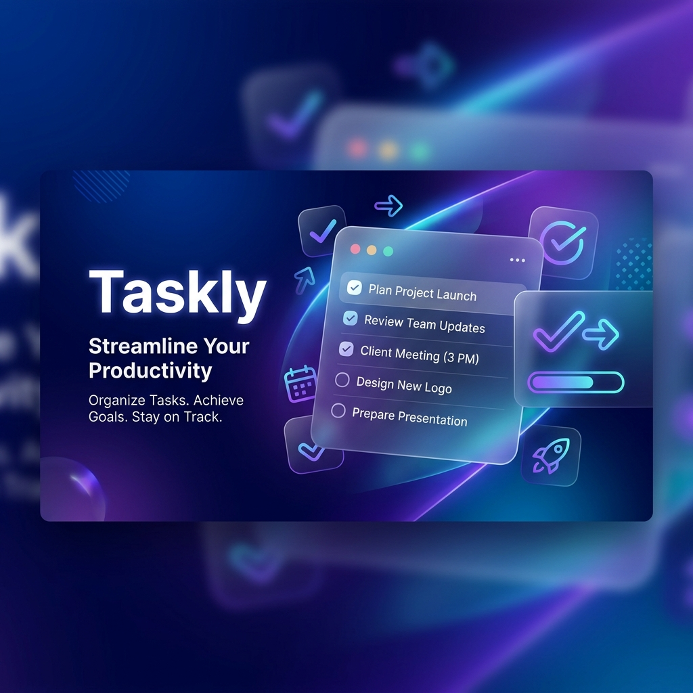

# Taskly 🚀



**Taskly** is a high-performance, premium task management application built with Flutter. It combines a state-of-the-art "Offline-First" synchronization engine with a stunning modern user interface, giving you absolute zero-latency productivity no matter your connectivity.

---

## 🌟 Key Features

### 🔄 Robust Offline-First Sync
- **Zero-Latency UI:** All actions are performed instantly on a local SQLite database and synchronized in the background.
- **Bi-Directional Sync:** Changes from Firebase are merged silently into your local storage.
- **Conflict Resolution:** Smart timestamp-based merging ensures the most recent data is always preserved.
- **Reliable Offline Deletions:** Soft-delete markers ensure that tasks deleted offline are automatically removed from the cloud upon reconnection.

### 🛡️ Expert Security & Privacy
- **Biometric Authentication:** Secure your tasks with FaceID or Fingerprint lock (local_auth).
- **Multi-Account Isolation:** Every user's data is strictly scoped and encrypted at the account level.
- **Privacy Mode:** Discrete notification toggles to hide sensitive task content from the lock screen.
- **Total Data Control:** Complete account deletion flow that wipes all associated Firestore and Auth data.

### 📅 Advanced Productivity
- **Focus Mode:** Searchable task selection with a premium circular progress timer for deep work sessions.
- **Calendar Integration:** Visualize your schedule and deadlines with a sleek, interactive calendar view.
- **Categorization & Priority:** Organise your life with custom categories and visual priority indicators.

---

## 🏗️ Technical Architecture

Taskly follows a strict **Clean Architecture** pattern to ensure scalability and maintainability:

- **Presentation:** Powered by **BLoC/Cubit** for reactive state management. Responsive UI crafted with `flutter_screenutil`.
- **Domain:** Pure business logic including Entities and UseCases.
- **Data:** Repository implementations coordinating between **Cloud Firestore** and **SQLite** (sqflite).
- **Dependency Injection:** Centralised service registry managed via **GetIt** and **Injectable**.

---

## 🛠️ Tech Stack

- **Framework:** [Flutter](https://flutter.dev)
- **State Management:** [flutter_bloc](https://pub.dev/packages/flutter_bloc)
- **Local Database:** [sqflite](https://pub.dev/packages/sqflite)
- **Backend:** [Firebase](https://firebase.google.com) (Auth, Firestore)
- **Connectivity:** [connectivity_plus](https://pub.dev/packages/connectivity_plus)
- **Responsive Layout:** [flutter_screenutil](https://pub.dev/packages/flutter_screenutil)
- **DI:** [injectable](https://pub.dev/packages/injectable) & [get_it](https://pub.dev/packages/get_it)

---

## 🚀 Getting Started

### Prerequisites
- Flutter SDK (latest stable)
- Java 17+ (for Android builds)
- A Firebase project configured for both Android and iOS

### Installation

1. **Clone the repository:**
   ```bash
   git clone https://github.com/Mustafa-Mohamed26/Taskly.git
   ```

2. **Install dependencies:**
   ```bash
   flutter pub get
   ```

3. **Generate DI & Models:**
   ```bash
   dart run build_runner build --delete-conflicting-outputs
   ```

4. **Run the application:**
   ```bash
   flutter run
   ```

---

## 📂 Project Structure

```text
lib/
├── config/             # DI, Themes, and App Configurations
├── core/               # Services, Utils, Constant and Error templates
├── data/               # Models, DataSources, and Repository Implementations
├── domain/             # Entities and Repository Contracts
└── presentation/       # UI Screens, Cubits, and Responsive Widgets
```

---

## 📝 License

Distributed under the MIT License. See `LICENSE` for more information.

---

<p align="center">
  Built with ❤️ by the Taskly Team
</p>
